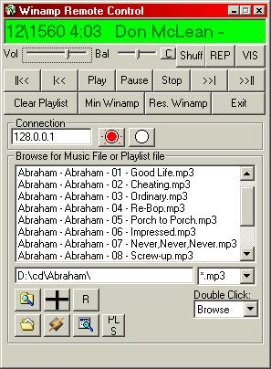



## Control Winamp from a Remote Computer

### Description

I wrote this because my Roommate, likes to leave his computer running his MP3's with his screensaver locked, so now I can change his songs, playlist, or stop it completely. It has two Applications, a host and a Client, run the host on the computer that you want to control the winamp on, and run the Client from your computer.
 
### More Info
 
Need to know target IP and the target IP must have the Host Application Running.

I didn't write the WINAMP API but James Crasta did, and I didn't write the Find Files Class but GDuncan Did, I beleive I got both code from PSC.com.

The MP3's Music that you want.

May make your roommate made when you turn on/off the vis, or min/normalize winamp, or stop his music or make it loud or something.

             |
---                |---
**Submitted On**   |2001-09-21 16:03:48
**By**             |[Dispos\_hero](https://github.com/Planet-Source-Code/PSCIndex/blob/master/ByAuthor/dispos-hero.md)
**Level**          |Intermediate
**User Rating**    |4.8 (43 globes from 9 users)
**Compatibility**  |VB 5\.0, VB 6\.0
**Category**       |[Sound/MP3](https://github.com/Planet-Source-Code/PSCIndex/blob/master/ByCategory/sound-mp3__1-45.md)
**World**          |[Visual Basic](https://github.com/Planet-Source-Code/PSCIndex/blob/master/ByWorld/visual-basic.md)
**Archive File**   |[Control Wi267699212001\.zip](https://github.com/Planet-Source-Code/dispos-hero-control-winamp-from-a-remote-computer__1-27449/archive/master.zip)

### API Declarations

Look in the Zip for them.

